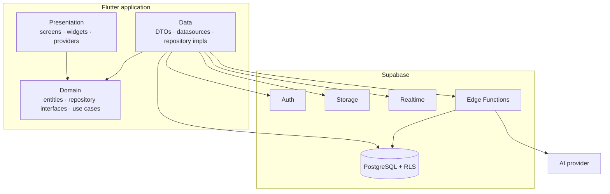
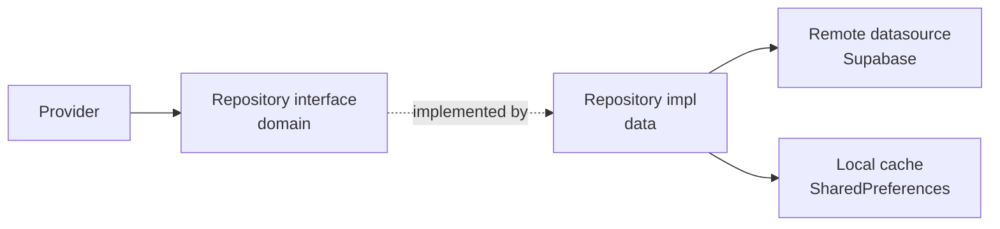
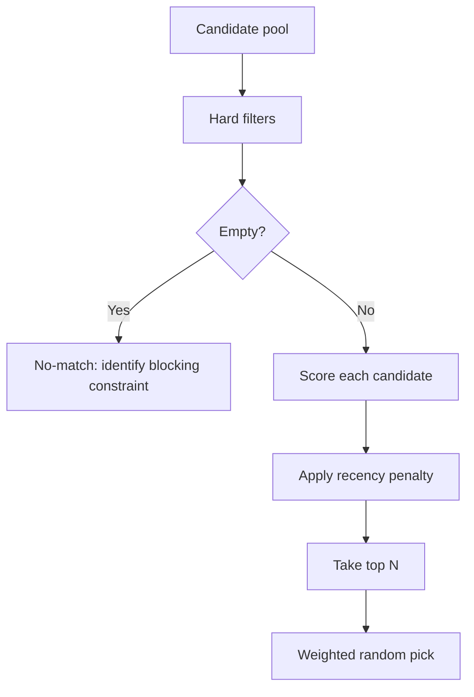
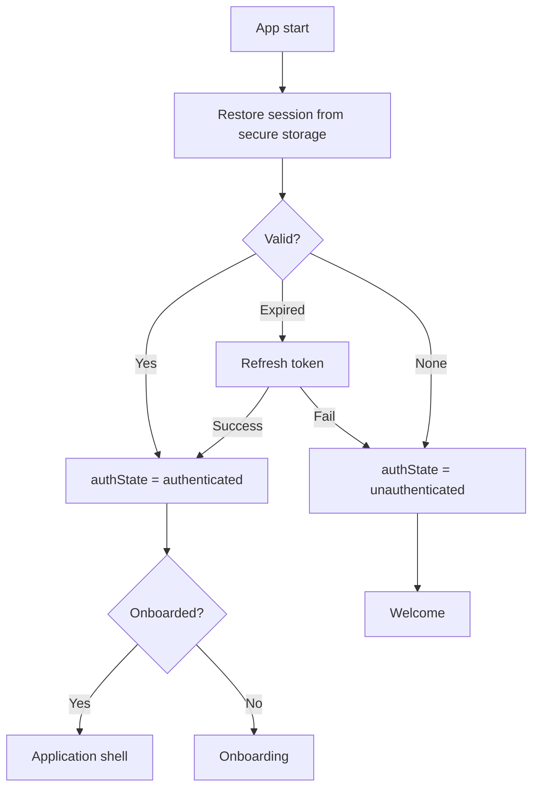

# What's Cooking? — Technical Architecture

| Field | Value |
| ----- | ----- |
| **Status** | Approved — Sprint 05 |
| **Implements** | Phase 2 (Sprints 06–10) and Phase 3 (Sprints 11–15) |
| **Related** | [DATABASE.md](DATABASE.md) · [CODING_STANDARDS.md](CODING_STANDARDS.md) · [NAVIGATION_MAP.md](NAVIGATION_MAP.md) · [PRD.md](PRD.md) |

This document fixes the technical decisions for the life of the project. Where a decision
had a credible alternative, the alternative and the reason for rejecting it are recorded —
so a future reader can tell a *choice* from an *accident*.

---

## 1. System overview



**The one hard rule:** the Flutter client never holds a privileged credential. It carries
the Supabase **anon key** only. Every privileged operation runs behind Row Level Security or
inside an Edge Function.

---

## 2. Flutter architecture

### 2.1 Layers

Feature-based Clean Architecture. Three layers per feature, with a strict dependency rule.

```text
features/<feature>/
├── data/
│   ├── datasources/      Supabase calls, raw responses
│   ├── dtos/             Wire models with fromJson/toJson
│   ├── mappers/          DTO ↔ entity
│   └── repositories/     Repository implementations
├── domain/
│   ├── entities/         Pure Dart, no serialization, no Flutter
│   ├── repositories/     Abstract interfaces
│   └── usecases/         Business operations, only where logic is non-trivial
├── presentation/
│   ├── screens/          Route-level widgets
│   ├── widgets/          Feature-local widgets
│   └── providers/        Riverpod providers and notifiers
└── <feature>.dart        Barrel export
```

```text
presentation ──▶ domain ◀── data
```

**Domain depends on nothing** — not Flutter, not Supabase, not `dio`. This is what makes the
recommendation engine unit-testable without a device or a network.

### 2.2 Use cases — a deliberate limit

A use case is written **only** when logic is non-trivial or spans repositories. Simple
pass-through reads go straight from provider to repository.

Wrapping `getMeals()` in a `GetMealsUseCase` that calls `getMeals()` adds a file, a test and
a layer of indirection to buy nothing. Use cases exist for: recommendation scoring,
ingredient matching, grocery generation from a meal, household preference merging, and
weekly plan generation.

### 2.3 Cross-feature dependencies

Features never import each other's internals. They may import another feature's **barrel**,
and only downward through this order:

```text
auth → profile → meals → roulette → history → pantry → grocery → couple → planner → ai
```

Anything needed by two or more features moves to `core/`. When two features genuinely need
each other, the shared piece belongs in `core/`, not in a cycle.

### 2.4 Core

```text
core/
├── config/         AppEnv — compile-time environment values
├── constants/      Non-visual app constants
├── errors/         AppException hierarchy, failure mapping
├── extensions/     BuildContext, DateTime, num, String helpers
├── network/        Supabase client provider, connectivity, retry policy
├── router/         GoRouter config, guards, route names
├── theme/          Tokens from DESIGN_SYSTEM.md
├── utils/          Logger, formatters, validators
└── widgets/        Shared components from COMPONENTS.md
```

---

## 3. State management — Riverpod

### 3.1 Provider taxonomy

| Kind | Use | Example |
| ---- | --- | ------- |
| `Provider` | Stateless dependencies | `mealRepositoryProvider` |
| `FutureProvider` | One-shot async read | `mealDetailProvider(id)` |
| `StreamProvider` | Realtime subscriptions | `groceryListStreamProvider` |
| `NotifierProvider` | Synchronous mutable state | `rouletteFiltersNotifier` |
| `AsyncNotifierProvider` | Async state with mutations | `pantryNotifier` |

All are generated with `@riverpod`. Hand-written providers are permitted only where
generation cannot express the shape.

### 3.2 Async state

`AsyncValue` is the single async contract. Screens render it with `.when(...)`, which makes
the four mandatory UI states structurally impossible to forget:

```text
AsyncValue<T>
├── loading  → skeleton matching the real layout
├── error    → ErrorState with a retry
└── data     → content, or EmptyState when the collection is empty
```

**No feature invents its own loading boolean.** A `bool isLoading` alongside a `String?
error` alongside a `List<T> items` is three fields that can disagree; `AsyncValue` is one
that cannot.

### 3.3 Error propagation — exceptions, not `Result`

Repositories **throw** typed `AppException`s. They do not return `Result<T>`.

`AsyncValue` already captures errors as a first-class state, so a `Result` wrapper would be
unwrapped and immediately re-wrapped at every call site. The alternative was considered and
rejected: it costs boilerplate at every layer and buys type-safety that `AsyncError` already
provides in practice.

Where a caller must branch on failure — a login form distinguishing bad credentials from a
network error — it catches the specific exception type.

### 3.4 Scoping and disposal

* `autoDispose` is the default. Long-lived state (session, active household, preferences) is
  explicitly kept alive.
* `ref.keepAlive()` guards expensive results — the meal catalogue page 1, for instance —
  with an explicit timer.
* Realtime subscriptions live in `StreamProvider`s so disposal is automatic. A manually
  managed subscription is a leak waiting for a review to catch it.

---

## 4. Repository pattern



**Contract**

* Interfaces live in `domain/repositories/` and speak only in **entities**.
* Implementations live in `data/repositories/`, own DTO↔entity mapping, and map every
  `PostgrestException`, `AuthException` and `SocketException` into an `AppException`.
* **No Supabase type crosses the data boundary.** A `PostgrestException` reaching a widget
  is a review failure.
* Every repository is injected through a provider, so tests substitute a fake with one
  `overrideWith`.

### Caching

Read-through, deliberately modest — the MVP is explicitly **not** offline-first
([PRD.md](PRD.md) non-goal 7).

| Data | Strategy | TTL | Built |
| ---- | -------- | --- | ----- |
| Meal catalogue | Cache **unfiltered** first page | 24 h | Sprint 27 |
| Favourite / hidden id sets | Cache, refresh on change | 6 h | Sprint 27 |
| Meal detail | In-memory for a window after viewing | 45 s | Sprint 27 |
| Meal detail (on disk) | Cache on view | 24 h | — |
| User preferences | Cache, refresh on change | Session | — |
| Pantry, grocery | Network first, cache fallback | Session | — |
| Meal history | Cache last 30 days | 1 h | — |
| Household | Cache, refresh on change | Session | — |

**Two layers, doing different jobs.** `TimestampedStore` is the persistent one —
`SharedPreferences`, one JSON payload per key, every key prefixed `cache.` so sign-out can
sweep them without knowing what any feature stored. `Ref.cacheFor` is the in-memory one: it
holds an `autoDispose` provider alive for a window after its last listener leaves, which is
what stops the meal-detail screen re-fetching every time someone steps in and out of a list.

**Only the unfiltered first page is persisted, deliberately.** A filtered page is cheap to
re-fetch and no use offline — somebody who filtered for "under 30 minutes" and then lost
signal needs *something to cook*, not their something — so caching every permutation would
buy a cache-invalidation problem in exchange for nothing. The dislike set is cached beside it
because the feed reads it *before* its first page: without it, a cold start with no signal
fails the Meals tab before the cached catalogue is ever consulted.

A cached page comes back with `MealPage.cachedAt` set and `hasMore` false, and the screen
says so. A stale catalogue presented as current is the app lying about the one thing it is
for. `Meal.toRow` is the inverse of `Meal.fromRow`, so the cache and the wire share one
decoder — including its tolerance of values this build does not recognise.

Auth and permission failures never fall back to the cache. The fix for those is signing in,
and yesterday's meals would hide that from the person who needs to see it.

**The roulette must work against cache alone** ([USER_FLOWS.md](USER_FLOWS.md) §18). A user
with no signal still gets a decision — that is the core promise, and it does not get a
network dependency.

---

## 5. The recommendation engine

### 5.1 Placement — client-side, pure Dart

The engine lives in `features/roulette/domain/usecases/`, with **zero** Flutter and Supabase
imports.

| Consideration | Client | Server (Edge Function) |
| ------------- | ------ | ---------------------- |
| Latency | Instant | Network round trip |
| Works offline | ✅ | ❌ |
| Testability | Pure functions | Needs deployment |
| Tuning without release | ❌ | ✅ |
| Candidate pool size | Limited by device | Unbounded |

Chosen: **client-side.** Sub-second latency and offline capability are product requirements;
remote tuning is not. **Scoring weights are stored as data, not constants**, so they can be
moved to a remote config later without touching the algorithm.

Revisit if the catalogue exceeds ~5,000 meals or personalisation needs cross-user signals.

### 5.2 Pipeline



**Hard filters** — eliminate, never penalise: disliked meals, dietary violations, budget
ceiling, cooking-time ceiling, explicit cuisine or category selection.

**Soft scoring** — the weights from [app_feature.md](app_feature.md), stored as data:

| Signal | Weight |
| ------ | -----: |
| Preference match | +30 |
| Partner compatibility | +25 |
| Budget match | +20 |
| Ingredient match | +20 |
| Favourite | +15 |
| Cuisine variety | +10 |
| Cooking-time match | +10 |
| Recent meal | −15 |

Selection takes the top *N* (default 10) and picks with probability proportional to score.
This is what produces the product's required feel:

> **It should feel random, but never feel stupid.**

Pure `top-1` is deterministic and stops feeling like a roulette. Uniform random over the
pool is what every competitor already does badly.

### 5.3 Testability

The engine is a pure function of `(candidates, preferences, history, filters, weights) →
ranked list`. Sprint 40's scenario tests — low budget, short time, conflicting preferences —
run in milliseconds with no device and no network. This is the single strongest reason the
domain layer forbids Flutter imports.

---

## 6. Supabase architecture

### 6.1 Responsibilities

| Service | Used for |
| ------- | -------- |
| Auth | Email/password, Google, Apple. Sessions, refresh, recovery |
| PostgreSQL | All application data, RLS-enforced |
| Storage | Meal images, avatars |
| Realtime | Grocery list, household changes, voting (v1.1) |
| Edge Functions | AI proxy, household invite redemption, account deletion |

### 6.2 The personal-household decision

**Every user gets a household on signup**, created by a database trigger and flagged
`is_personal`. `profiles.active_household_id` names the current context.

This is the highest-leverage decision in the schema. The alternative — nullable
`household_id` everywhere, with solo users writing personal rows — means every query,
policy and provider branches on "household or not". That branch would appear in meal
history, pantry, grocery, planner, statistics and every RLS policy, and each one is a place
to get it wrong.

With a personal household:

* Every scoped table has a **non-null** `household_id`. No branch anywhere.
* One set of RLS policies covers solo and couple users identically.
* Couple mode becomes "invite someone into your household" — not a different data model.
* Leaving a household reverts `active_household_id` to the personal one. No orphaned data.

Cost: one extra row per user, and joining a partner means switching context rather than
merging. That is a fair price for deleting a conditional from every layer of the stack.

### 6.3 Realtime

Subscriptions are opened **only** on screens that need them, and only when the active
household has more than one member — a solo user has nobody to sync with, and an open
socket is battery spend for nothing.

| Table | Event | Consumer |
| ----- | ----- | -------- |
| `grocery_items` | INSERT, UPDATE, DELETE | Grocery screen |
| `household_members` | INSERT, DELETE | Couple screen |
| `meal_votes` | INSERT | Can't Agree |
| `meal_history` | INSERT | Home decided state |

### 6.4 Edge Functions

Only three qualify for MVP + 2.0. An Edge Function is justified **only** when the client
must not hold a secret, or when an operation must be atomic across tables.

| Function | Why it cannot be client-side |
| -------- | ---------------------------- |
| `ai-assistant` | Holds the AI provider keys — **built, Sprint 59** |
| `ai-fridge-scan` | Holds the AI provider keys (Sprint 62; may fold into the above) |
| `redeem-invite` | Atomic: validate, join, expire — must not half-apply |
| `delete-account` | Cascading deletion across households |

Every function authenticates the caller's JWT, applies rate limiting, and logs usage.
**Never trust a client-supplied user ID** — read it from the verified token.

#### The AI provider chain

`ai-assistant` holds **three** keys and tries them in order — Groq, then Gemini, then
OpenAI — each with its own 12-second timeout. The timeout is the point: a provider that
returns an error is easy to handle, and a provider that accepts the connection and then
thinks for forty seconds is what actually ruins the experience. A plain try/catch misses that
case entirely.

The order is latency first (Groq is far the fastest, and this sits in front of somebody
deciding what to eat tonight), then cost, with OpenAI last because it is the most likely to
be up when the other two are not — which is what you want from a last resort rather than a
first choice. A **400 does not fail over**: a request built wrongly will be built wrongly for
the next provider too, and trying two more spends three round trips reaching the same
answer. A 429, a 5xx, a timeout and even a 401 all do, so one bad key cannot take the feature
down.

One `ai_usage` row is written per request whether it succeeded or not (migration 0017). That
row is *both* the rate limit and the cost record, because two sources of truth would
disagree — and recording failures is what makes a bad evening explainable at all: `attempts`
above 1 is a failover that actually happened.

The client cannot express which provider answers, cannot pass a model, and holds no key.
`AppEnv.assertNoProviderKey()` throws on the first frame if one is ever compiled in, because
nothing downstream would notice: the assistant would work perfectly and the build would ship
with three billable credentials readable by anyone who unzips it.

The system prompt lives in the function too, for the same reason the keys do — one shipped in
the client is one a determined user can replace. Context the app sends is rendered as a
labelled block of *facts*, explicitly not instructions, because a context value came from
something a user typed.

---

## 7. Authentication



* Session and refresh tokens are held by `supabase_flutter` in platform secure storage —
  Keychain on iOS, EncryptedSharedPreferences on Android. **Never** in plain
  `SharedPreferences`.
* A single `authStateProvider` is the app's only source of auth truth. The GoRouter redirect
  watches it; no screen performs its own check.
* Refresh is automatic and silent. A 401 triggers one refresh-and-retry before the user
  sees anything ([USER_FLOWS.md](USER_FLOWS.md) §18).
* Sign-up creates the profile, preferences and personal household **in a database trigger**,
  not in client code. A crash mid-signup cannot leave a half-provisioned account.

---

## 8. Security model

### 8.1 Principles

1. **RLS is the security boundary**, not client code. The client is untrusted by design.
2. **Deny by default.** RLS enabled on every table; no policy means no access.
3. **Least privilege.** The anon key can do exactly what policies allow.
4. **No secrets in the bundle.** Service-role and AI keys exist only in Edge Function
   environments.
5. **Server-side identity.** `auth.uid()` in policies; never a client-supplied ID.

### 8.2 The recursion trap

Household membership creates a classic RLS cycle: the policy on `household_members` needs to
check membership, which queries `household_members`, which evaluates the policy.

Solved with a `SECURITY DEFINER` function that bypasses RLS for the check itself:

```sql
create or replace function public.is_household_member(hid uuid)
returns boolean
language sql
security definer
set search_path = public
stable
as $$
  select exists (
    select 1 from household_members
    where household_id = hid and user_id = auth.uid()
  );
$$;
```

Every household-scoped policy calls this. `set search_path` is mandatory — a `SECURITY
DEFINER` function without it is a privilege-escalation vector.

### 8.3 Access matrix

| Table | Read | Write |
| ----- | ---- | ----- |
| `profiles` | Self + household members | Self |
| `households` | Members | Owner |
| `household_members` | Members | Owner, or self to leave |
| `household_invites` | Household members | Owner |
| `meals` | Public catalogue + own household's | Creator |
| `ingredients` | All authenticated | Authenticated (append-only) |
| `user_preferences` | **Self only** | Self |
| `favorite_meals` | Self + household members | Self |
| `disliked_meals` | **Self only** | Self |
| `meal_history` | Household members | Household members |
| `pantry_items` | Household members | Household members |
| `grocery_lists` / `grocery_items` | Household members | Household members |
| `meal_plans` | Household members | Household members |

**Dislikes are private, favourites are shared.** A partner seeing what you dislike is a
social cost with no product benefit; the engine reads both server-side regardless.

### 8.4 Storage

| Bucket | Access |
| ------ | ------ |
| `meal-images` | Public read; write restricted to the meal's creator |
| `avatars` | Public read; write restricted to self |

Uploads are validated for MIME type and size, and resized client-side before upload.

---

## 9. Error handling

```text
AppException (sealed)
├── NetworkException      No connectivity, timeout
├── ServerException       5xx, unexpected Postgrest failure
├── AuthException         Invalid credentials, expired session
├── PermissionException   RLS denial, wrong household
├── NotFoundException     Missing resource
├── ValidationException   Client-side rules
└── UnknownException      Escape hatch — always logged
```

Every exception carries a **user-facing message** written for a person, plus an optional
technical detail that is logged and never displayed
([COMPONENTS.md](COMPONENTS.md) §13).

Mapping happens exactly once, in the data layer. Global handlers catch anything that escapes
so an unhandled exception cannot reach a raw Flutter error screen.

---

## 10. Analytics

The north-star metric must be measurable from the first build, not retrofitted.

| Event | Properties |
| ----- | ---------- |
| `app_open` | timestamp, cold/warm |
| `spin_started` | filters applied, household size |
| `spin_completed` | meal_id, score, candidate pool size, latency |
| `meal_accepted` | meal_id, **seconds since app_open**, spin count |
| `meal_rejected` | meal_id, spin count |
| `no_match` | blocking constraint |
| `onboarding_step` | step, completed/skipped |
| `household_created` / `invite_accepted` | — |
| `pantry_item_added` / `grocery_generated` | item count |

`meal_accepted.seconds_since_app_open` **is** Time to Decision. Everything else is
diagnostic. Events carry no PII and no meal names — IDs only.

---

## 11. Testing strategy

| Layer | Type | Coverage bar |
| ----- | ---- | ------------ |
| Domain use cases | Unit | **Mandatory** — engine, matching, budget, grocery |
| Repositories | Unit with fakes | Happy path + every mapped error |
| Providers | Unit with overrides | State transitions |
| Widgets | Widget tests | Every component in `core/widgets/` |
| Flows | Integration | Auth, roulette, pantry→grocery, household |
| RLS | SQL tests | Every policy, including denial cases |

**RLS denial tests are not optional.** A policy that grants correctly but fails to deny is
indistinguishable from a working policy until it is a breach.

---

## 12. Performance budgets

| Metric | Budget |
| ------ | -----: |
| Cold start to interactive | 1.5 s |
| Spin tap → candidates ready | 500 ms |
| P95 spin latency | 2 s |
| Meal feed first paint | 800 ms |
| Scroll | 60 fps, no frame > 16 ms |
| Memory, steady state | < 150 MB |
| APK / IPA size | < 40 MB |

Enforced by: `const` constructors everywhere possible, `select()` narrowed to needed columns,
paginated lists with `ListView.builder`, `cached_network_image` with resized variants, and
providers scoped so a rebuild never cascades past its subtree.

---

## 13. Decision record

| # | Decision | Rejected alternative | Why |
| - | -------- | -------------------- | --- |
| 1 | Feature-based Clean Architecture | Layer-first | Features stay independently ownable and deletable |
| 2 | Riverpod with codegen | Bloc, Provider | Compile-safe, testable, less boilerplate |
| 3 | Typed exceptions | `Result<T>` | `AsyncValue` already models failure; `Result` doubles the wrapping |
| 4 | Use cases only for real logic | Use case per method | Indirection without benefit |
| 5 | Client-side engine | Edge Function | Offline capability and latency are product requirements |
| 6 | Weights as data | Constants | Enables remote tuning later without an algorithm change |
| 7 | **Personal household for every user** | Nullable `household_id` | Deletes a conditional from every query, policy and provider |
| 8 | Private dislikes, shared favourites | Both shared | Social cost, no product benefit |
| 9 | RLS as the boundary | Client-side checks | The client is untrusted by definition |
| 10 | `SECURITY DEFINER` helper | Recursive policy | Avoids infinite recursion on `household_members` |
| 11 | Freezed for models | Manual | Immutability, equality and `copyWith` for free |
| 12 | Read-through cache | Offline-first sync | Shared data makes conflict resolution disproportionate |
| 13 | Realtime only when household > 1 | Always on | Battery cost with no benefit for solo users |
| 14 | Analytics from build one | Add before beta | Time to Decision cannot be measured retroactively |
