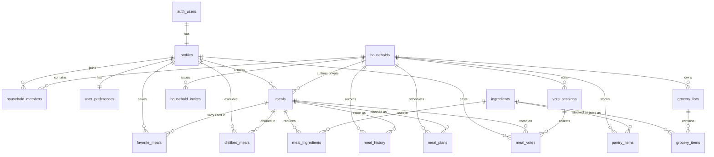

# What's Cooking? — Database Design

| Field | Value |
| ----- | ----- |
| **Status** | Approved — Sprint 05 |
| **Implements** | Sprints 12–15 (schema, relationships, RLS) |
| **Engine** | PostgreSQL 15 via Supabase |
| **Related** | [ARCHITECTURE.md](ARCHITECTURE.md) · [PRD.md](PRD.md) · [app_feature.md](app_feature.md) |

> **Rescoped at Sprint 37.** This app is for **two people sharing one phone**, not a
> product with users (docs/app_feature.md, "Scope"). One account, one device. Couple
> Mode, realtime sync, the meal planner, gamification, statistics, notifications,
> monetization and the store launch are all cut; a restaurant roulette is added.
> Sections describing cut work are **kept and marked** rather than deleted — their
> numbers are cited from code, and a section that vanishes reads as an oversight
> instead of a decision. See docs/project_dev.md, "Cut".


---

## 1. Entity relationship diagram



---

## 2. Conventions

| Rule | Value |
| ---- | ----- |
| Primary keys | `uuid`, `default gen_random_uuid()` |
| Timestamps | `timestamptz`, `default now()` |
| Naming | `snake_case`, plural tables, singular columns |
| Foreign keys | `<entity>_id`, always indexed |
| Soft delete | **Not used.** Deletes cascade. |
| Money | `numeric(10,2)`, PHP. Never `float`. |
| Enums | Postgres `enum` types, not free text |
| RLS | **Enabled on every table without exception** |
| `updated_at` | Maintained by trigger, never by the client |

---

## 3. Enumerated types

```sql
create type meal_category  as enum ('breakfast','lunch','dinner','snack','dessert');
create type meal_type      as enum ('breakfast','lunch','dinner','snack','dessert');
create type difficulty     as enum ('easy','medium','hard');
create type household_role as enum ('owner','member');
create type invite_status  as enum ('pending','accepted','expired','revoked');
create type vote_choice    as enum ('like','pass');
create type dietary_tag    as enum (
  'vegetarian','vegan','pescatarian','halal','kosher',
  'gluten_free','dairy_free','nut_free','low_carb','keto'
);
```

`meal_type` gained `dessert` in migration 0018: the catalogue has desserts and the roulette can offer one, so recording what was eaten had nowhere honest to put it. It also gives the planner a fifth slot in a day.

Cuisine is **`text` with a check constraint**, not an enum — the catalogue will gain cuisines
over time, and altering an enum in production is far more disruptive than editing a
constraint.

---

## 4. Tables

### 4.1 `profiles`

Extends `auth.users`. Created by trigger on signup.

| Column | Type | Notes |
| ------ | ---- | ----- |
| `id` | `uuid` PK | FK → `auth.users(id)` on delete cascade |
| `display_name` | `text` not null | |
| `avatar_url` | `text` | Storage path |
| `active_household_id` | `uuid` | FK → `households(id)` on delete set null |
| `onboarding_completed` | `boolean` not null default false | Router guard reads this |
| `created_at` / `updated_at` | `timestamptz` | |

`active_household_id` is the **current context** for every household-scoped write. See
[ARCHITECTURE.md](ARCHITECTURE.md) §6.2.

### 4.2 `households`

| Column | Type | Notes |
| ------ | ---- | ----- |
| `id` | `uuid` PK | |
| `name` | `text` not null | Defaults to "<name>'s Kitchen" |
| `created_by` | `uuid` not null | FK → `profiles(id)` |
| `is_personal` | `boolean` not null default true | Auto-created solo household |
| `default_budget` | `numeric(10,2)` | Household-level default |
| `default_servings` | `smallint` not null default 2 | |
| `created_at` / `updated_at` | `timestamptz` | |

A personal household is created for **every** user by trigger. Inviting a partner flips
`is_personal` to false.

### 4.3 `household_members`

| Column | Type | Notes |
| ------ | ---- | ----- |
| `id` | `uuid` PK | |
| `household_id` | `uuid` not null | FK, cascade |
| `user_id` | `uuid` not null | FK → `profiles(id)`, cascade |
| `role` | `household_role` not null default `'member'` | |
| `joined_at` | `timestamptz` | |

`unique (household_id, user_id)`. Indexed on both columns — every RLS policy hits this table.

### 4.4 `household_invites`

| Column | Type | Notes |
| ------ | ---- | ----- |
| `id` | `uuid` PK | |
| `household_id` | `uuid` not null | FK, cascade |
| `code` | `text` not null unique | 8 chars, unambiguous alphabet |
| `created_by` | `uuid` not null | FK → `profiles(id)` |
| `status` | `invite_status` not null default `'pending'` | |
| `expires_at` | `timestamptz` not null | Default `now() + 7 days` |
| `accepted_by` | `uuid` | FK → `profiles(id)` |
| `created_at` | `timestamptz` | |

Codes exclude `0`, `O`, `1`, `I` — they will be read aloud and typed by hand. Redemption runs
in the `redeem-invite` Edge Function so validation, membership insert and status update are
atomic.

**Dead as of Sprint 37.** There is one phone and one account
(docs/USER_FLOWS.md §14), so nobody is ever invited and no code is ever redeemed. The
table was never created, the `redeem-invite` Edge Function was never written, and the
`invite_status` enum in §3 is unused — it should come out with the next enum migration,
alongside `vote_choice`.

Described here rather than deleted because the section number is cited, and because a
schema that quietly loses a table reads as an accident.

### 4.5 `meals`

Holds both the public catalogue and household-private custom meals.

| Column | Type | Notes |
| ------ | ---- | ----- |
| `id` | `uuid` PK | |
| `name` | `text` not null | |
| `description` | `text` | |
| `image_url` | `text` | |
| `cuisine` | `text` not null | Check-constrained |
| `category` | `meal_category` not null | |
| `difficulty` | `difficulty` not null default `'easy'` | |
| `cooking_time_minutes` | `smallint` not null | Check `> 0` |
| `estimated_cost` | `numeric(10,2)` not null | PHP, per the stated servings |
| `servings` | `smallint` not null default 2 | |
| `calories` | `integer` | Display only — never a tracked target |
| `instructions` | `jsonb` not null default `'[]'` | Ordered array of step strings |
| `dietary_tags` | `dietary_tag[]` not null default `'{}'` | |
| `tags` | `text[]` not null default `'{}'` | Mood and free-form: comfort, spicy, quick |
| `is_public` | `boolean` not null default false | Catalogue membership |
| `created_by` | `uuid` | FK → `profiles(id)`, null for seeded meals |
| `household_id` | `uuid` | FK → `households(id)`, set for custom meals |
| `created_at` / `updated_at` | `timestamptz` | |

Check constraint: a meal is either public (`is_public` true, `household_id` null) or private
to a household (`is_public` false, `household_id` not null). Nothing may be both or neither.

Instructions are `jsonb` rather than a child table because they are always read as a whole
ordered unit and never queried individually. A `meal_steps` table would add a join to every
detail view to buy nothing.

**Indexes:** `cuisine`, `category`, `cooking_time_minutes`, `estimated_cost`,
`(is_public, household_id)`, GIN on `dietary_tags` and `tags`, and a GIN trigram index on
`name` for search.

### 4.6 `ingredients`

Shared vocabulary, append-only.

| Column | Type | Notes |
| ------ | ---- | ----- |
| `id` | `uuid` PK | |
| `name` | `text` not null unique | Lowercase, singular |
| `category` | `text` not null | protein, vegetable, grain, dairy, spice, condiment, other |
| `default_unit` | `text` not null | g, ml, pc, tbsp, tsp, cup |
| `is_staple` | `boolean` not null default false | **Excluded from match calculations** |
| `created_at` | `timestamptz` | |

`is_staple` implements the rule in [USER_FLOWS.md](USER_FLOWS.md) §12: salt, pepper, oil and
water never reduce a pantry match percentage. Without it every meal caps near 80% and the
number stops carrying information.

### 4.7 `meal_ingredients`

| Column | Type | Notes |
| ------ | ---- | ----- |
| `id` | `uuid` PK | |
| `meal_id` | `uuid` not null | FK, cascade |
| `ingredient_id` | `uuid` not null | FK, restrict |
| `quantity` | `numeric(10,2)` not null | |
| `unit` | `text` not null | |
| `is_optional` | `boolean` not null default false | Excluded from match denominator |

`unique (meal_id, ingredient_id)`. Ingredient deletion is `restrict` — silently emptying
recipes is not an acceptable failure mode.

### 4.8 `user_preferences`

Private to the user. Created by trigger on signup.

| Column | Type | Notes |
| ------ | ---- | ----- |
| `id` | `uuid` PK | |
| `user_id` | `uuid` not null unique | FK, cascade |
| `favorite_cuisines` | `text[]` not null default `'{}'` | |
| `disliked_ingredients` | `uuid[]` not null default `'{}'` | Ingredient IDs. The long-term shape — the engine filters on ids |
| `disliked_ingredient_names` | `text[]` not null default `'{}'` | Free text captured at onboarding, before the ingredient catalogue can match it. Reconciled into `disliked_ingredients` later; unmatched entries stay here rather than being discarded. Capped at 50, no blanks |
| `dietary_tags` | `dietary_tag[]` not null default `'{}'` | **Hard filter** |
| `default_budget` | `numeric(10,2)` | |
| `max_cooking_time` | `smallint` | Minutes |
| `preferred_servings` | `smallint` not null default 2 | |
| `repetition_window_days` | `smallint` 0–60 | Days before a meal may be offered again. Null = app default; **0 = the household does not mind repeats** (0019) |
| `created_at` / `updated_at` | `timestamptz` | |

### 4.9 `favorite_meals` and `disliked_meals`

Identical shape; different visibility.

| Column | Type |
| ------ | ---- |
| `id` | `uuid` PK |
| `user_id` | `uuid` not null FK |
| `meal_id` | `uuid` not null FK |
| `created_at` | `timestamptz` |

`unique (user_id, meal_id)` on each. **Favourites are visible to household members; dislikes
are private** ([ARCHITECTURE.md](ARCHITECTURE.md) §8.3).

### 4.10 `meal_history`

The repetition-prevention input, and the app's record of decisions.

| Column | Type | Notes |
| ------ | ---- | ----- |
| `id` | `uuid` PK | |
| `household_id` | `uuid` not null | FK, cascade |
| `meal_id` | `uuid` not null | FK, restrict |
| `decided_by` | `uuid` not null | FK → `profiles(id)` |
| `eaten_at` | `timestamptz` not null default `now()` | |
| `meal_type` | `meal_type` not null | |
| `actual_cost` | `numeric(10,2)` | Null until the user edits it |
| `source` | `text` not null default `'roulette'` | roulette, manual, planner, ai |
| `was_cooked` | `boolean` not null default true | Cooked vs ordered — feeds statistics |
| `created_at` | `timestamptz` | |

**Index:** `(household_id, eaten_at desc)` — the recency query runs on every spin and must
never table-scan.

### 4.11 `pantry_items`

| Column | Type | Notes |
| ------ | ---- | ----- |
| `id` | `uuid` PK | |
| `household_id` | `uuid` not null | FK, cascade |
| `ingredient_id` | `uuid` not null | FK, cascade |
| `quantity` | `numeric(10,2)` | Null = "have some" |
| `unit` | `text` | |
| `expiration_date` | `date` | v1.2 |
| `added_by` | `uuid` | FK → `profiles(id)` |
| `created_at` / `updated_at` | `timestamptz` | |

`unique (household_id, ingredient_id)` — adding an existing ingredient updates quantity
rather than creating a duplicate row.

### 4.12 `grocery_lists` and `grocery_items`

**`grocery_lists`**

| Column | Type | Notes |
| ------ | ---- | ----- |
| `id` | `uuid` PK | |
| `household_id` | `uuid` not null | FK, cascade |
| `name` | `text` not null default `'Grocery List'` | |
| `is_active` | `boolean` not null default true | One active list per household |
| `created_at` / `updated_at` | `timestamptz` | |

**`grocery_items`**

| Column | Type | Notes |
| ------ | ---- | ----- |
| `id` | `uuid` PK | |
| `grocery_list_id` | `uuid` not null | FK, cascade |
| `ingredient_id` | `uuid` | FK — null for free-text entries |
| `custom_name` | `text` | Used when `ingredient_id` is null |
| `quantity` | `numeric(10,2)` | |
| `unit` | `text` | |
| `is_completed` | `boolean` not null default false | |
| `completed_by` | `uuid` | FK → `profiles(id)` |
| `completed_at` | `timestamptz` | |
| `added_from_meal_id` | `uuid` | FK → `meals(id)` — provenance |
| `created_at` | `timestamptz` | |

Check: exactly one of `ingredient_id` or `custom_name` is present. Free text matters — a user
in a supermarket must be able to add "the good soy sauce" without our vocabulary approving it
first.

`added_from_meal_id` lets the UI show *why* an item is on the list, and lets removal of a
planned meal clean up after itself.

### 4.13 ~~`meal_plans`~~ — cut at Sprint 37

Was a weekly planner slot: `household_id`, `meal_id`, `planned_date`, `meal_type`,
unique per slot.

**Never created, and now never will be.** The premise of this app is deciding at
seven in the evening; a planner answers what we will eat on Thursday, which is the
opposite question (docs/USER_FLOWS.md §16). Ingredient reuse — the one genuinely
valuable thing the planner was for — survives in a smaller form: the pantry weights
the roulette toward meals that use what is already in the kitchen.

*Section number retained so §4.14 onward and every code citation still resolve.*

### 4.14 ~~`vote_sessions`~~ and ~~`meal_votes`~~ — cut at Sprint 37

Was a frozen candidate set plus one row per partner per meal, intersected to find a
match.

**Never created.** Two people standing in the same kitchen can say "not that one"
out loud, and a voting round would add a turn-taking protocol, a waiting state and a
no-match fallback to a conversation that already works
(docs/USER_FLOWS.md §15). The `vote_choice` enum in §3 is unused and should come out
with the next enum migration.

### 4.15 `restaurants` — Sprint 45

The second library. Ours, manually written, with no discovery layer.

| Column | Type | Notes |
| ------ | ---- | ----- |
| `id` | `uuid` PK | |
| `household_id` | `uuid` not null | FK, cascade. Always household-scoped — unlike `meals`, there is no public catalogue of these |
| `name` | `text` not null | |
| `cuisine` | `text` not null | Same twelve values as `meals.cuisine` |
| `cost_per_head` | `numeric(10,2)` not null | A head, not a bill — the number both roulettes filter on |
| `proximity` | `proximity` not null | New enum: `walk`, `short_ride`, `worth_the_trip` |
| `delivers` | `boolean` not null default false | |
| `notes` | `text` | |
| `go_to_order` | `text` | What we get there. The single most useful field on the whole table and the reason this is not a maps integration |
| `tags` | `text[]` not null default `'{}'` | So moods work over restaurants too |
| `created_by` | `uuid` | FK → `profiles(id)`, set null |
| `created_at` / `updated_at` | `timestamptz` | |

`unique (household_id, lower(name))` — the same place added twice is a data-entry
slip, not two restaurants.

**`proximity` is an enum, not a distance.** Kilometres would need a location
permission, a maps provider and a coordinate per row, to produce a number nobody
uses: the real decision is *can we walk, do we have to ride, or is it a trip*. Three
values answer it and cost nothing.

### 4.16 `restaurant_history` — Sprint 46

| Column | Type | Notes |
| ------ | ---- | ----- |
| `id` | `uuid` PK | |
| `household_id` | `uuid` not null | FK, cascade |
| `restaurant_id` | `uuid` not null | FK, cascade |
| `decided_by` | `uuid` not null | FK → `profiles(id)`. Checked against `auth.uid()` by the insert policy |
| `eaten_at` | `timestamptz` not null default `now()` | |
| `estimated_cost` | `numeric(10,2)` | Copied at decision time, because the restaurant's own price will drift |
| `actual_cost` | `numeric(10,2)` | What it really came to |
| `created_at` | `timestamptz` | |

Separate from `meal_history` rather than a nullable `restaurant_id` bolted onto it.
The two share a shape and not a meaning: one records cooking and the other records
going out, every query wants one or the other, and a single table would need a
`check` constraint asserting exactly one of two foreign keys is set — which is the
shape of a table doing two jobs.

**No uniqueness.** A household can eat at the same place twice in a day, and a
retried insert being indistinguishable from the truth is why this write never
retries.

---

## 5. Triggers and functions

### 5.1 Provision a new user

Runs on `auth.users` insert: creates the profile, its preferences row, a personal household,
the owner membership, and points `active_household_id` at it — atomically.

```sql
create or replace function public.handle_new_user()
returns trigger
language plpgsql
security definer
set search_path = public
as $$
declare
  new_household_id uuid;
  name text := coalesce(new.raw_user_meta_data->>'display_name', 'Friend');
begin
  insert into profiles (id, display_name)
  values (new.id, name);

  insert into households (name, created_by, is_personal)
  values (name || '''s Kitchen', new.id, true)
  returning id into new_household_id;

  insert into household_members (household_id, user_id, role)
  values (new_household_id, new.id, 'owner');

  insert into user_preferences (user_id) values (new.id);

  update profiles set active_household_id = new_household_id where id = new.id;

  return new;
end;
$$;

create trigger on_auth_user_created
  after insert on auth.users
  for each row execute function public.handle_new_user();
```

This is why signup cannot leave a half-provisioned account
([ARCHITECTURE.md](ARCHITECTURE.md) §7).

### 5.2 Membership check

```sql
create or replace function public.is_household_member(hid uuid)
returns boolean
language sql
security definer
set search_path = public
stable
as $$
  select exists (
    select 1 from household_members
    where household_id = hid and user_id = auth.uid()
  );
$$;
```

Breaks the RLS recursion described in [ARCHITECTURE.md](ARCHITECTURE.md) §8.2.
`set search_path` is **mandatory** on every `SECURITY DEFINER` function.

### 5.3 `updated_at`

A single `set_updated_at()` trigger function, attached to every table carrying the column.
Clients never write it.

---

## 6. Row Level Security

Enabled on every table. Representative policies:

```sql
-- profiles: self, plus anyone sharing a household
create policy "read own profile"
  on profiles for select
  using (id = auth.uid());

create policy "read household members' profiles"
  on profiles for select
  using (exists (
    select 1 from household_members hm
    where hm.user_id = profiles.id
      and public.is_household_member(hm.household_id)
  ));

create policy "update own profile"
  on profiles for update
  using (id = auth.uid()) with check (id = auth.uid());

-- household-scoped tables: identical shape everywhere
create policy "household members read"
  on meal_history for select
  using (public.is_household_member(household_id));

create policy "household members write"
  on meal_history for insert
  with check (public.is_household_member(household_id));

-- meals: public catalogue plus your household's private meals
create policy "read visible meals"
  on meals for select
  using (is_public or public.is_household_member(household_id));

create policy "creator manages own meals"
  on meals for all
  using (created_by = auth.uid()) with check (created_by = auth.uid());

-- dislikes: strictly private, no household exception
create policy "own dislikes only"
  on disliked_meals for all
  using (user_id = auth.uid()) with check (user_id = auth.uid());
```

### Sprint 15 test matrix

Every policy is tested for **grant and denial**. A policy that grants correctly but fails to
deny is indistinguishable from a working one until it is a breach.

| Scenario | Expected |
| -------- | -------- |
| Read another household's `meal_history` | Denied |
| Read another user's `disliked_meals` | Denied |
| Read another user's `user_preferences` | Denied |
| Read a household member's `favorite_meals` | Allowed |
| Write to a household you left | Denied |
| Read a private meal from another household | Denied |
| Read a public meal | Allowed |
| Non-owner modifies `households` | Denied |
| Member removes themselves | Allowed |
| Anonymous reads any table | Denied |

---

## 7. Index summary

| Table | Index | Serves |
| ----- | ----- | ------ |
| `household_members` | `(user_id)`, `(household_id)` | Every RLS check |
| `meal_history` | `(household_id, eaten_at desc)` | Recency on every spin |
| `meals` | `(cuisine)`, `(category)`, `(cooking_time_minutes)`, `(estimated_cost)` | Roulette filters |
| `meals` | `(is_public, household_id)` | Visibility |
| `meals` | GIN `dietary_tags`, GIN `tags` | Array containment |
| `meals` | GIN trigram `name` | Search |
| `meal_ingredients` | `(meal_id)`, `(ingredient_id)` | Match both directions |
| `pantry_items` | `(household_id)` | Pantry read |
| `grocery_items` | `(grocery_list_id)` | List read |
| `favorite_meals` / `disliked_meals` | `(user_id)` | Scoring |
| `household_invites` | `(code)` unique | Redemption |
| `meals` | `(cost_per_serving)` | Budget filter and cheapest sort (0015) |
| `meals` | `(name, id)`, `(cooking_time_minutes, id)`, `(cost_per_serving, id)`, `(created_at desc, id)` | The Meals tab's four sorts, paged (0016) |
| `meals` | `(created_at desc, id)` where `not is_public` | `MealRepository.mine` (0016) |

**Why the sort indexes end in `id` (0016).** Every sort the feed offers is a *total* order,
because paging depends on it — two rows that compare equal can swap places between the
request for page one and the request for page two, and the reader sees one meal twice while
never seeing another. A single-column index cannot serve `order by x, id`: Postgres walks it
for `x` and then sorts the whole matching set to break ties. With the key in the index the
ordering is already there, so `limit`/`offset` reads one page and stops. The 0008 indexes are
still the right ones for the roulette's filter-only queries, where there is nothing to order.

The ingredient-match query joins `pantry_items` to `meal_ingredients` across the catalogue —
the heaviest read in the app, and the one most likely to regress. It is a benchmark target
for whenever the pantry match ships (Sprint 33), not an afterthought.

---

## 8. Migrations

```text
supabase/migrations/
├── 20260820000001_extensions_and_enums.sql
├── 20260820000002_core_tables.sql
├── 20260820000003_meals_ingredients.sql
├── 20260820000004_preferences.sql
├── 20260820000005_history_pantry_grocery.sql
├── 20260820000006_planner_voting.sql
├── 20260820000007_functions_triggers.sql
├── 20260820000008_indexes.sql
├── 20260820000009_rls_policies.sql
├── 20260820000010_grants.sql
├── 20260820000011_onboarding_dislikes.sql
├── 20260820000012_avatars_storage.sql
└── 20260820000013_delete_own_account.sql
```

Regenerate `supabase/schema.sql` from these with `supabase/tool/build_schema.sh`, and verify a
database against `supabase/verify.sql` after applying.

Migrations are forward-only and never edited once applied to staging. Every one is applied to
development, then staging, then production — in that order, without exception.

### 8.1 Storage

| Bucket | Public | Limit | Types | Purpose |
| ------ | ------ | ----- | ----- | ------- |
| `avatars` | Yes | 2 MB | jpeg, png, webp | Profile photos, at `<user_id>/avatar.<ext>` |

`avatars` is public deliberately. Photos are shown to a household partner and rendered by
`cached_network_image`; signing every request would put a round trip in front of a 44 px
circle, and nothing private lives there. **Public governs reads only** — the write policies
check that the first path segment equals `auth.uid()`, so a user can only ever write inside
their own folder.

The client resizes to 512 px before uploading. The 2 MB ceiling is the backstop, not the
plan: a modern phone photo is several times that, and an unbounded bucket is a bill.

### 8.2 Privileged functions

| Function | Why it is `security definer` |
| -------- | ---------------------------- |
| `handle_new_user()` | Writes four rows across tables the new user cannot yet see |
| `delete_own_account()` | `auth.users` is not writable by the app's key |

`delete_own_account()` **takes no arguments by design.** It deletes `auth.uid()` and nothing
else, so there is no parameter to tamper with. A `delete_user(id uuid)` variant would be a
privilege-escalation hole no matter how carefully it checked its input, and this is the
property to preserve if the function is ever changed.

---

## 9. Open schema questions

| # | Question | Resolve by |
| - | -------- | ---------- |
| Q5 | Cost estimates — national average, or per-household override table? | Sprint 23 |
| Q8 | Custom meals private, or promotable into the public catalogue? | Sprint 26 |

**Restaurant repetition window — resolved at Sprint 46: its own.** One setting does
not cover both. A household happy to cook adobo twice in a week is not necessarily
happy to eat out twice in a week, and the money is the reason — so the default block
is a week against a meal's two days, and the taper a month against a fortnight. It is
a constant in `VisitSettings` rather than a column, because nobody has asked to tune
it and a preference nobody sets is a screen nobody opens.

**Unit conversion — resolved at Sprint 39: neither.** The question was normalise on
write or convert on read, and the answer is that nothing converts. Both options need a
density table to turn a bottle of soy sauce into grams, and neither has anything
sensible to do with "1 bulb" of garlic. What the pantry is *for* is Sprint 41's
question — **do we have any**, not do we have enough. Presence, not arithmetic. A unit
is therefore a note to the reader, stored in the words they typed.

**Q7 — household size cap. Resolved at Sprint 37: two.** The app is for two people
(docs/app_feature.md, "Scope"). Nothing enforces a numeric cap in the schema, because a
`check` on a count is a trigger and a trigger is a thing to maintain — but no flow creates a
third member, and no screen offers to.

**`meal_history.rating` — dropped, not deferred.** It existed for the preference learning
cut at Sprint 37. Over a library we wrote ourselves, asking us to rate a meal we chose to
add is asking a question we answered by adding it, and the roulette already reads favourites
and history. A rating column with nothing reading it is a column that gets a UI built for it
eventually because it is there.

### Resolved

**Q4 — Initial catalogue size and cuisine split.** Settled in Sprint 21 at **60 public
meals**: Filipino 20, Japanese 8, Korean 7, Chinese 7, Italian 7, Mexican 5, American 6.
Across categories: breakfast 6, lunch 14, dinner 25, snack 6, dessert 9.

The number comes from what has to survive Sprint 30's filters intersecting and Sprint 32's
refusal to repeat. A spin that finds nothing is the one failure this product cannot survive,
and sixty leaves roughly a dozen candidates in the narrowest realistic case — one cuisine,
under thirty minutes, under two hundred pesos. The Filipino third is [MVP_SCOPE.md](MVP_SCOPE.md)'s
"Filipino-leaning" made concrete: a roulette that keeps landing on carbonara is a roulette
these users stop trusting.

Sprint 21 also added migration 0014, a partial unique index on `lower(name)` where
`is_public`. It makes the seed re-runnable, and it is a real catalogue invariant besides —
two public meals with the same name are indistinguishable to the person choosing between
them.
