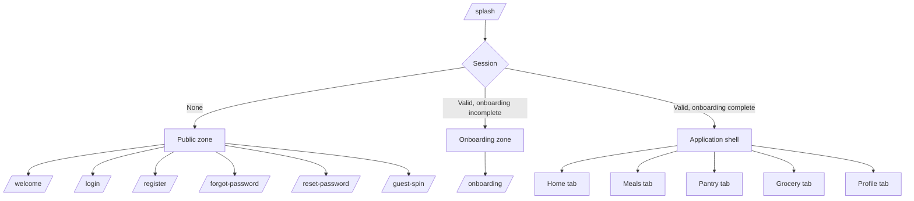
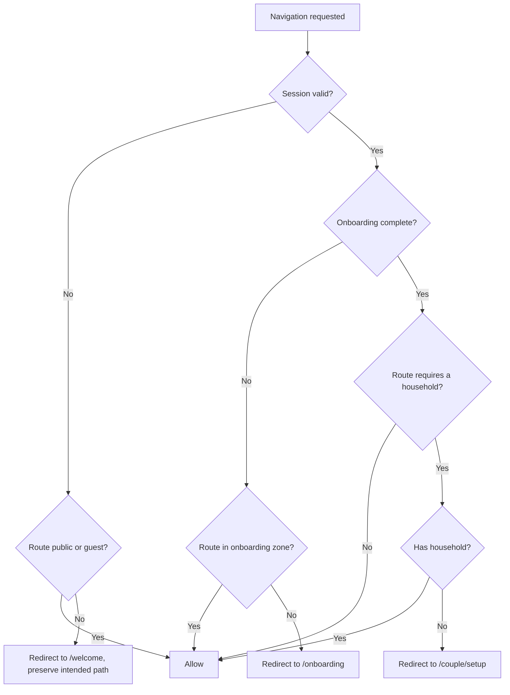

# What's Cooking? — Navigation Map

| Field | Value |
| ----- | ----- |
| **Status** | Approved — Sprint 03 |
| **Implements** | GoRouter configuration, Sprint 09 |
| **Related** | [USER_FLOWS.md](USER_FLOWS.md) · [design_ui.md](design_ui.md) · [MVP_SCOPE.md](MVP_SCOPE.md) |

This is the specification Sprint 09 implements directly. Route paths, names, guards and
transitions are fixed here so they do not get invented ad hoc per feature.

---

## 1. Structure

Three zones, each with different guard behaviour:

The shell hosts the floating bottom navigation (`design_ui.md` §7) and persists across tab
switches. Each tab owns an independent navigation stack; switching tabs preserves depth.

---

## 2. Route table

`Auth` column: **P** public · **G** guest-allowed · **A** authenticated · **O** onboarded.

### Public

| Path | Name | Auth | Notes |
| ---- | ---- | ---- | ----- |
| `/splash` | `splash` | P | Session restore. Never a branded delay. |
| `/welcome` | `welcome` | P | Sign up · Log in · Try it first |
| `/login` | `login` | P | Accepts `?redirect=` return path |
| `/register` | `register` | P | |
| `/forgot-password` | `forgotPassword` | P | |
| `/reset-password` | `resetPassword` | P | Deep-link target, requires `token` |
| `/guest-spin` | `guestSpin` | G | Limited spins, no persistence (P1) |

### Onboarding

| Path | Name | Auth | Notes |
| ---- | ---- | ---- | ----- |
| `/onboarding` | `onboarding` | A | Internal step state; not one route per step |
| `/onboarding/household` | `onboardingHousehold` | A | Optional branch |

Onboarding is a single route with internal paging so a mid-flow back gesture cannot strand
the user between partially-saved steps.

### Home tab

| Path | Name | Auth | Notes |
| ---- | ---- | ---- | ----- |
| `/home` | `home` | AO | Default tab |
| `/home/filters` | `rouletteFilters` | AO | Bottom sheet. Budget, time, meal type, cuisine and effort; dietary needs shown but locked |
| `/home/spin` | `roulette` | AO | Full-screen, no bottom nav |
| `/home/result/:mealId` | `rouletteResult` | AO | Full-screen |
| `/home/decided/:historyId` | `decided` | AO | Post-acceptance celebration |
| `/home/cooking/:mealId` | `cookingMode` | AO | Keeps screen awake (P1) |

### Meals tab

| Path | Name | Auth | Notes |
| ---- | ---- | ---- | ----- |
| `/meals` | `meals` | AO | Feed with filter pills |
| `/meals/search` | `mealSearch` | AO | |
| `/meals/favorites` | `favorites` | AO | |
| `/meals/disliked` | `dislikedMeals` | AO | Hidden meals, and the only way to un-hide one |
| `/meals/history` | `mealHistory` | AO | Household-scoped when applicable |
| `/meals/mine` | `myMeals` | AO | Custom meals |
| `/meals/new` | `mealCreate` | AO | |
| `/meals/:id` | `mealDetail` | AO | Hero transition from any card |
| `/meals/:id/edit` | `mealEdit` | AO | Author's own only; inside the tab, not the root navigator |

### Pantry tab

| Path | Name | Auth | Notes |
| ---- | ---- | ---- | ----- |
| `/pantry` | `pantry` | AO | |
| `/pantry/add` | `pantryAdd` | AO | Bottom sheet |
| `/pantry/matches` | `ingredientMatches` | AO | Ranked by match percentage |

### Grocery tab

| Path | Name | Auth | Notes |
| ---- | ---- | ---- | ----- |
| `/grocery` | `grocery` | AO | |
| `/grocery/add` | `groceryAdd` | AO | Bottom sheet |

### Profile tab

| Path | Name | Auth | Notes |
| ---- | ---- | ---- | ----- |
| `/profile` | `profile` | AO | |
| `/profile/preferences` | `preferences` | AO | |
| `/profile/budget` | `budgetSettings` | AO | |
| `/profile/statistics` | `statistics` | AO | P1 |
| `/profile/settings` | `settings` | AO | |
| `/profile/settings/notifications` | `notificationSettings` | AO | P2 |
| `/profile/settings/appearance` | `appearanceSettings` | AO | |
| `/profile/settings/account` | `accountSettings` | AO | Includes deletion |

### Couple — reached from Profile and the Home header

| Path | Name | Auth | Notes |
| ---- | ---- | ---- | ----- |
| `/couple` | `couple` | AO | Redirects to setup when no household |
| `/couple/setup` | `householdSetup` | AO | Create or join |
| `/couple/create` | `householdCreate` | AO | |
| `/couple/join` | `householdJoin` | AO | Accepts `?code=` |
| `/couple/invite` | `householdInvite` | AO | Code and share sheet |
| `/couple/vote` | `cantAgree` | AO | P1/T2 |
| `/couple/vote/result` | `cantAgreeResult` | AO | P1/T2 |

### Planner — **v1.3, not in MVP**

| Path | Name | Auth |
| ---- | ---- | ---- |
| `/planner` | `planner` | AO |
| `/planner/day/:date` | `plannerDay` | AO |
| `/planner/generate` | `plannerGenerate` | AO |

### System

| Path | Name | Notes |
| ---- | ---- | ----- |
| `/error` | `error` | Unrecoverable failure with a route home |
| `*` | `notFound` | Redirects to `/home` when authenticated, `/welcome` otherwise |

---

## 3. Bottom navigation

`design_ui.md` §7 specifies five tabs including Planner — but Planner is out of MVP scope
and Pantry is in it. The MVP therefore ships:

| Slot | Tab | Route |
| ---- | --- | ----- |
| 1 | Home | `/home` |
| 2 | Meals | `/meals` |
| 3 | Pantry | `/pantry` |
| 4 | Grocery | `/grocery` |
| 5 | Profile | `/profile` |

**Evolution at v1.3** — when the Planner arrives, five slots are already full. The
recommendation is to merge Pantry and Grocery into a single **Kitchen** tab with two
segments. They are the same mental space (what I have / what I need), the merge is
non-destructive, and it frees the slot Planner needs without reaching six tabs.

> **Decision required before Sprint 09.** The alternative is to drop Pantry to a Home entry
> point and keep Planner in slot 3, but that demotes an MVP T1 feature to reach a v1.3 one.

Couple mode is deliberately **not** a tab. It is reached from the Profile screen and from
the household indicator in the Home header — it is a *context* the whole app operates in,
not a destination.

---

## 4. Guards

Evaluated in order on every navigation:

**Rules**

* A redirect always preserves the intended destination, so post-login the user lands where
  they were going — never on Home by default.
* An authenticated user hitting a public route is redirected to `/home`. Reaching the login
  screen while logged in is a bug, not a feature.
* Guards are declarative in the router. No screen performs its own auth check — one place to
  reason about, one place to get wrong.

---

## 5. Deep links

Scheme `whatscooking://`, plus HTTPS App Links / Universal Links on `whatscooking.app`.

| Link | Route | Behaviour when signed out |
| ---- | ----- | ------------------------- |
| `/reset-password?token=` | `resetPassword` | Opens directly — the whole point |
| `/join?code=` | `householdJoin` | Prompts sign-up, then resumes the join |
| `/meal/:id` | `mealDetail` | Prompts sign-up, then opens the meal |
| `/spin` | `home` then auto-spin | Widget and notification entry point |

The invite link is the growth path — a partner who taps it must land in the household with
minimal friction, including through an install. Store the pending code before the auth
detour and consume it after.

---

## 6. Transitions

| From → To | Transition |
| --------- | ---------- |
| Tab ↔ tab | Instant, no animation. Tabs must feel like places, not steps. |
| Screen → child | Platform default (iOS slide, Android fade-through) |
| Meal card → detail | Hero on image, shared-axis on text |
| Home → spin | Scale and fade — the spin takes over the screen |
| Spin → result | Spring reveal with haptic (`design_ui.md` §12) |
| Result → decided | Celebratory scale with confetti |
| Any → bottom sheet | Standard modal with rounded top corners, 28–32 px |
| Sheet dismissal | Drag-to-dismiss enabled everywhere |

All transitions respect the platform reduce-motion setting: motion degrades to a cross-fade,
and the roulette's cycling shortens to a direct reveal while keeping the haptic.

---

## 7. Back-navigation rules

| Context | Back behaviour |
| ------- | -------------- |
| Root of a non-Home tab | Switch to Home tab |
| Root of Home tab | System back — exit the app |
| Nested screen | Pop one level |
| Spin in progress | Cancel the spin, return to Home; no result recorded |
| Result screen | Return to Home; result discarded, treated as a rejection signal |
| Decided screen | Return to Home in its decided state; **the acceptance stands** |
| Onboarding | Back to previous step; already-saved answers persist |
| Cooking mode | Confirm before exit — losing your place mid-cook is costly |
| Unsaved custom meal | Confirm before discarding |

The result-vs-decided distinction matters: backing out of a *result* rejects it, backing out
of *decided* does not undo a decision the user already made.

---

## 8. State preserved across tab switches

| Tab | Preserved |
| --- | --------- |
| Home | Filters, current result, decided state |
| Meals | Scroll position, active filters, search query |
| Pantry | Scroll position |
| Grocery | Scroll position, check states |
| Profile | Nothing — always opens at root |

Re-tapping the active tab scrolls to top; re-tapping again pops that tab to its root.

---

## 9. Implementation notes for Sprint 09

* One `StatefulShellRoute.indexedStack` for the five tabs, each branch with its own
  navigator key.
* Full-screen routes (`/home/spin`, `/home/result`, `/home/decided`, `/home/cooking`) use
  the **root** navigator so they cover the bottom navigation.
* Bottom sheets are routes, not imperative `showModalBottomSheet` calls — they must be
  deep-linkable and must survive configuration changes.
* Route names are the constants used everywhere; **never navigate by raw path string**.
* The redirect callback reads auth and onboarding state from Riverpod and is the single
  source of guard truth.
* Path parameters are typed at the route boundary; screens receive typed arguments, not raw
  strings.
