# What's Cooking? — User Flows

| Field | Value |
| ----- | ----- |
| **Status** | Approved — Sprint 03 |
| **Covers** | Every major journey in the application |
| **Related** | [PRD.md](PRD.md) · [NAVIGATION_MAP.md](NAVIGATION_MAP.md) · [design_ui.md](design_ui.md) |

Every flow below is traced to the user stories it satisfies. Diagrams render natively on
GitHub. Where a flow has failure paths, they are drawn — an unhandled path in a diagram is
an unhandled path in the app.

> **Rescoped at Sprint 37.** This app is for one household of two, not a product with
> users (docs/app_feature.md, "Scope"). Couple Mode, the meal planner, gamification,
> statistics, notifications, monetization and the store launch are cut; a restaurant
> roulette is added. Sections describing cut work are **kept and marked** rather than
> deleted — their numbers are cited from code, and a section that vanishes reads as an
> oversight instead of a decision. See docs/project_dev.md, "Cut".

---

## 0. Conventions

| Shape | Meaning |
| ----- | ------- |
| Rounded | Screen the user sees |
| Diamond | Decision or branch |
| Rectangle | System action, no UI |
| Doubled | Terminal state — the journey's goal |

**The governing constraint:** the critical path (§7) must complete in **under 60 seconds**.
Every screen on it is measured against that budget in §22.

---

## 1. First launch

*Satisfies US-A-01, US-A-05*

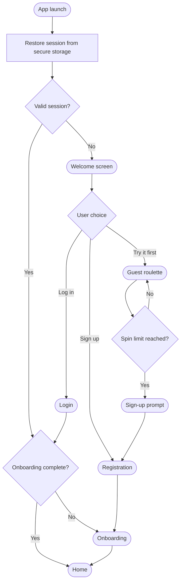
```mermaid
flowchart TD
    A([App launch]) --> B[Restore session from secure storage]
    B --> C{Valid session?}
    C -->|Yes| D{Onboarding complete?}
    C -->|No| E([Welcome screen])
    D -->|Yes| F([Home])
    D -->|No| G([Onboarding])
    E --> H{User choice}
    H -->|Sign up| I([Registration])
    H -->|Log in| J([Login])
    H -->|Try it first| K([Guest roulette])
    K --> L{Spin limit reached?}
    L -->|No| K
    L -->|Yes| M([Sign-up prompt])
    M --> I
    I --> G
    J --> D
    G --> F
```

**Rules**

* The splash screen is a session check, never a branded delay. If the session restores in
  under 400 ms, no splash is shown at all — the user lands directly on Home.
* Guest mode (US-A-01, **P1**) allows a limited number of spins with no persistence. Accept,
  favourite and history all prompt sign-up. Exact limit is open question **Q6**.
* A guest who signs up carries their in-memory preferences into onboarding rather than
  starting over.

---

## 2. Registration

*Satisfies US-A-02*

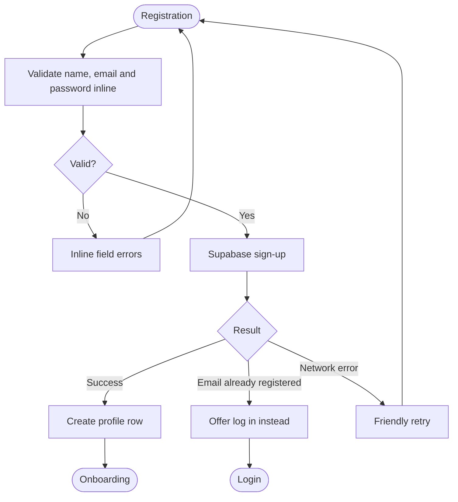
```mermaid
flowchart TD
    A([Registration]) --> C[Validate name, email and password inline]
    C --> F{Valid?}
    F -->|No| G[Inline field errors] --> A
    F -->|Yes| H[Supabase sign-up]
    H --> I{Result}
    I -->|Success| J[Create profile row]
    I -->|Email already registered| K[Offer log in instead] --> L([Login])
    I -->|Network error| M[Friendly retry] --> A
    J --> N([Onboarding])
```

**Rules**

* Validation is inline and immediate. No error is deferred to submit time when it could have
  been shown on blur.
* "Email already registered" offers a one-tap route to login with the address pre-filled —
  never a dead-end error.
* Profile row creation is a database trigger on `auth.users`, not a client call, so a crash
  between sign-up and profile creation cannot leave an orphaned account.

---

## 3. Login

*Satisfies US-A-02, US-A-05*

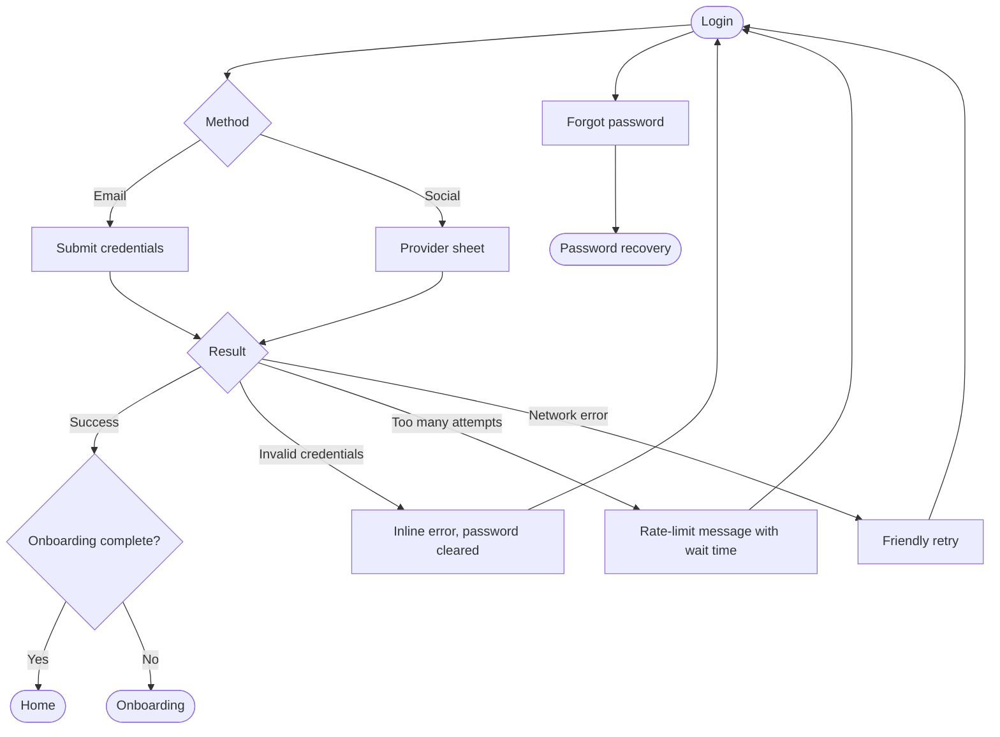
```mermaid
flowchart TD
    A([Login]) --> B{Method}
    B -->|Email| C[Submit credentials]
    B -->|Social| D[Provider sheet] --> E
    C --> E{Result}
    E -->|Success| F{Onboarding complete?}
    E -->|Invalid credentials| G[Inline error, password cleared] --> A
    E -->|Too many attempts| H[Rate-limit message with wait time] --> A
    E -->|Network error| I[Friendly retry] --> A
    F -->|Yes| J([Home])
    F -->|No| K([Onboarding])
    A --> L[Forgot password] --> M([Password recovery])
```

**Rules**

* A failed login never states which field was wrong — standard credential-enumeration
  defence.
* Session persists indefinitely via refresh token. The user should effectively never see
  the login screen again after first use.

---

## 4. Password recovery

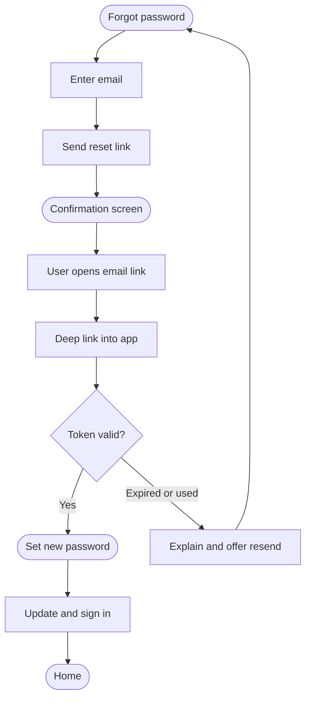
```mermaid
flowchart TD
    A([Forgot password]) --> B[Enter email] --> C[Send reset link]
    C --> D([Confirmation screen])
    D --> E[User opens email link]
    E --> F[Deep link into app]
    F --> G{Token valid?}
    G -->|Yes| H([Set new password]) --> I[Update and sign in] --> J([Home])
    G -->|Expired or used| K[Explain and offer resend] --> A
```

The confirmation screen says the same thing whether or not the address exists — again,
enumeration defence.

---

## 5. Onboarding

*Satisfies US-A-03, US-A-04, US-A-06*

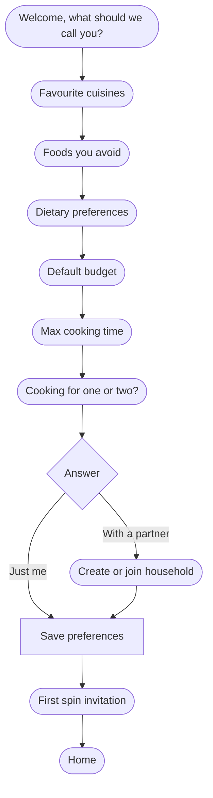
```mermaid
flowchart TD
    A([Welcome, what should we call you?]) --> B([Favourite cuisines])
    B --> C([Foods you avoid])
    C --> D([Dietary preferences])
    D --> E([Default budget])
    E --> F([Max cooking time])
    F --> G([Cooking for one or two?])
    G --> H{Answer}
    H -->|Just me| I[Save preferences]
    H -->|With a partner| J([Create or join household])
    J --> I
    I --> K([First spin invitation])
    K --> L([Home])
```

**Rules**

* Every step is skippable, and skipping is visible — not hidden behind a back gesture
  (US-A-06). Impatience must not cost us the user.
* Progress is shown. Six short steps feel finite; an unbounded questionnaire does not.
* Preferences are persisted **per step**, not at the end. An abandoned onboarding still
  leaves the app smarter than a blank one.
* The household prompt sits here because it is the highest-intent moment for couple mode —
  the user is already thinking about who they cook with.
* The flow ends by pointing at the spin. Onboarding's job is to deliver the user to their
  first decision, not to collect data.

---

## 6. Home

*Satisfies US-B-01, US-B-03*

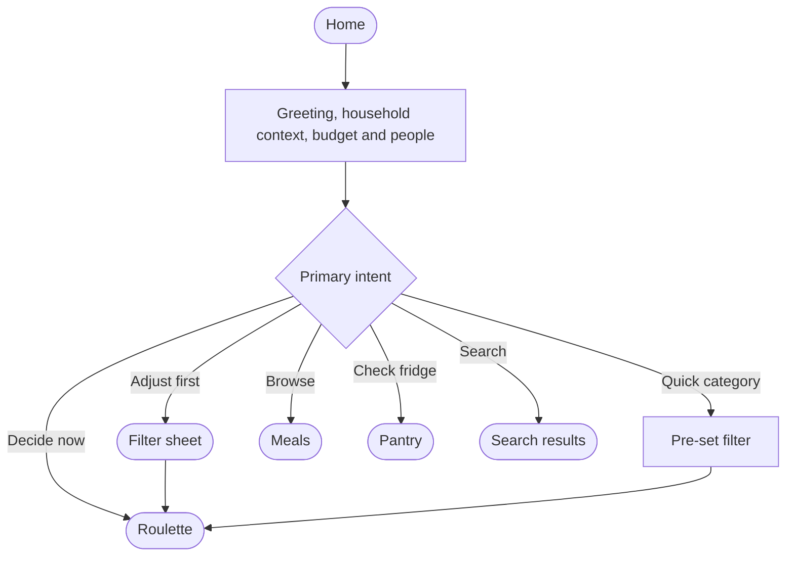
```mermaid
flowchart TD
    A([Home]) --> B[Greeting, household context, budget and people]
    B --> C{Primary intent}
    C -->|Decide now| D([Roulette])
    C -->|Adjust first| E([Filter sheet]) --> D
    C -->|Quick category| F[Pre-set filter] --> D
    C -->|Browse| G([Meals])
    C -->|Check fridge| H([Pantry])
    C -->|Search| I([Search results])
```

**Rules**

* SPIN is the single strongest affordance on the screen. Nothing competes with it visually
  (`design_ui.md` §11, §43).
* Quick-category cards are filter shortcuts that go **straight into a spin** — they are not
  browse entry points. Tapping "Comfort" spins within comfort food.
* Current budget and party size are always visible on Home, so the user never wonders what
  the app is about to assume.

---

## 7. The roulette — critical path

*Satisfies US-B-01 … US-B-09. **This is the product.***

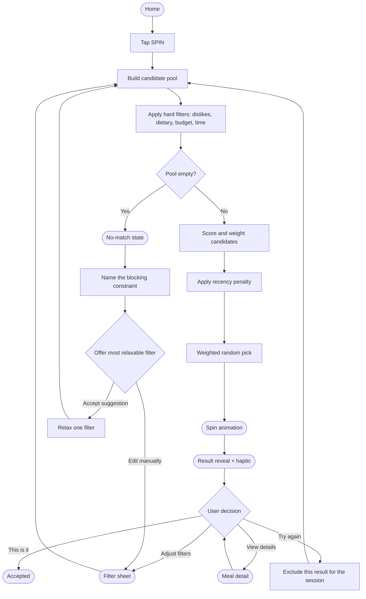
```mermaid
flowchart TD
    A([Home]) --> B[Tap SPIN]
    B --> C[Build candidate pool]
    C --> D[Apply hard filters: dislikes, dietary, budget, time]
    D --> E{Pool empty?}
    E -->|Yes| F([No-match state])
    E -->|No| G[Score and weight candidates]
    G --> H[Apply recency penalty]
    H --> I[Weighted random pick]
    I --> J([Spin animation])
    J --> K([Result reveal + haptic])
    K --> L{User decision}
    L -->|This is it| M([Accepted])
    L -->|Try again| N[Exclude this result for the session] --> C
    L -->|View details| O([Meal detail]) --> L
    L -->|Adjust filters| P([Filter sheet]) --> C
    F --> Q[Name the blocking constraint]
    Q --> R{Offer most relaxable filter}
    R -->|Accept suggestion| S[Relax one filter] --> C
    R -->|Edit manually| P
```

**Rules — non-negotiable**

* **Hard filters are hard.** Dislikes, dietary exclusions, budget and time are never
  silently relaxed to produce a result. Producing a meal the user cannot eat is worse than
  producing none (PRD principle 3).
* **The no-match state is a designed screen, not an error.** It names the specific blocking
  constraint — *"Nothing under ₱150 that also takes under 20 minutes"* — and offers the
  single filter whose relaxation opens the most options. It is never an empty grey screen.
* **Re-spins exclude prior results for the session.** Showing the same meal twice in a row
  reads as broken (US-B-04).
* **Animation is capped at ~3 s** and must be skippable by tap. Suspense that outstays its
  welcome fails the 60-second budget.
* **The result screen is self-sufficient:** name, cost, time and servings visible without
  scrolling (US-B-09 acceptance criteria).
* If scoring exceeds its latency budget, the app falls back to filtered-random and reveals
  a result rather than making the user wait. Slow is worse than slightly less clever.

---

## 8. Meal acceptance

*Satisfies US-B-05, US-C-08, US-E-03, US-E-04*

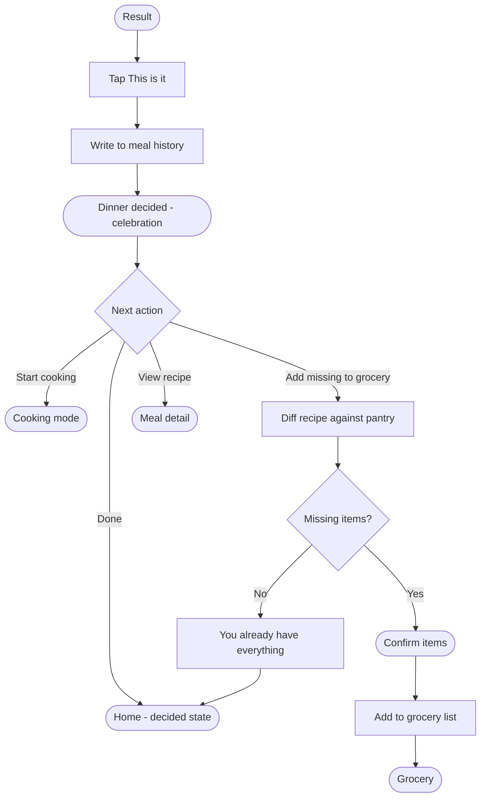
```mermaid
flowchart TD
    A([Result]) --> B[Tap This is it]
    B --> C[Write to meal history]
    C --> D([Dinner decided - celebration])
    D --> E{Next action}
    E -->|Start cooking| F([Cooking mode])
    E -->|Add missing to grocery| G[Diff recipe against pantry]
    E -->|View recipe| H([Meal detail])
    E -->|Done| I([Home - decided state])
    G --> J{Missing items?}
    J -->|Yes| K([Confirm items]) --> L[Add to grocery list] --> M([Grocery])
    J -->|No| N[You already have everything] --> I
```

**Rules**

* Acceptance is the **conversion event** and stops the time-to-decision timer. It is
  instrumented first-class.
* The history write is optimistic — the celebration never waits on the network. A failed
  write retries in the background and surfaces only if it fails permanently.
* Home enters a **decided state** afterwards, showing tonight's meal instead of the spin
  prompt. Re-opening the app should confirm the decision, not reopen it.
* "You already have everything" is a small delight moment and should be treated as one.

---

## 9. Meal discovery

*Satisfies US-C-01, US-C-02*

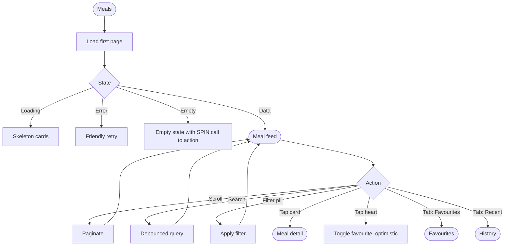
```mermaid
flowchart TD
    A([Meals]) --> B[Load first page]
    B --> C{State}
    C -->|Loading| D[Skeleton cards]
    C -->|Error| E[Friendly retry]
    C -->|Empty| F[Empty state with SPIN call to action]
    C -->|Data| G([Meal feed])
    G --> H{Action}
    H -->|Scroll| I[Paginate] --> G
    H -->|Search| J[Debounced query] --> G
    H -->|Filter pill| K[Apply filter] --> G
    H -->|Tap card| L([Meal detail])
    H -->|Tap heart| M[Toggle favourite, optimistic]
    H -->|Tab: Favourites| N([Favourites])
    H -->|Tab: Recent| O([History])
```

Search is debounced at 300 ms. Filters are additive and always show a clear-all. An empty
result set offers to relax the narrowest filter, matching the roulette's no-match pattern.

---

## 10. Meal detail and custom meals

*Satisfies US-C-03, US-C-04, US-C-05, US-C-06, US-C-07*

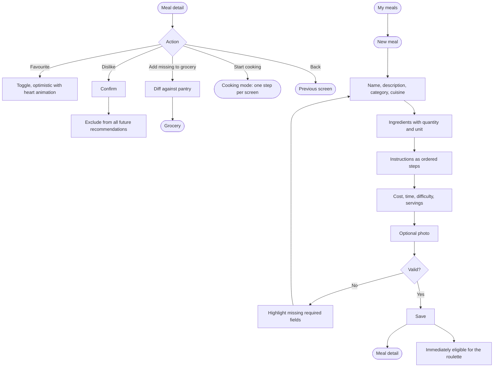
```mermaid
flowchart TD
    A([Meal detail]) --> B{Action}
    B -->|Favourite| C[Toggle, optimistic with heart animation]
    B -->|Dislike| D[Confirm] --> E[Exclude from all future recommendations]
    B -->|Add missing to grocery| F[Diff against pantry] --> G([Grocery])
    B -->|Start cooking| H([Cooking mode: one step per screen])
    B -->|Back| I([Previous screen])

    J([My meals]) --> K([New meal])
    K --> L[Name, description, category, cuisine]
    L --> M[Ingredients with quantity and unit]
    M --> N[Instructions as ordered steps]
    N --> O[Cost, time, difficulty, servings]
    O --> P[Optional photo]
    P --> Q{Valid?}
    Q -->|No| R[Highlight missing required fields] --> L
    Q -->|Yes| S[Save] --> T([Meal detail]) 
    S --> U[Immediately eligible for the roulette]
```

**Rules**

* Disliking asks for confirmation — it is a destructive-feeling action with lasting effect
  on recommendations, and an accidental tap erodes trust in the engine.
* A custom meal enters the candidate pool immediately. The user must see their own food come
  out of the roulette; that is what makes the app feel like *theirs*.
* Required fields for a custom meal are name and at least one ingredient. Everything else is
  optional — a half-filled custom meal is far better than an abandoned form.
* Cooking mode is one step per screen, large type, screen kept awake, no scrolling
  (`design_ui.md` §17).

---

## 11. Meal history

*Satisfies US-C-08, US-B-06*

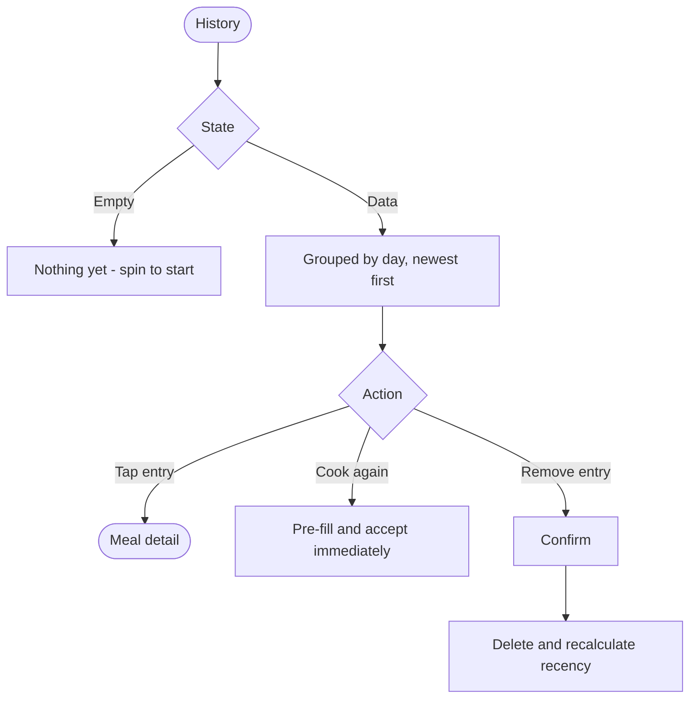
```mermaid
flowchart TD
    A([History]) --> B{State}
    B -->|Empty| C[Nothing yet - spin to start]
    B -->|Data| D[Grouped by day, newest first]
    D --> E{Action}
    E -->|Tap entry| F([Meal detail])
    E -->|Cook again| G[Pre-fill and accept immediately]
    E -->|Remove entry| H[Confirm] --> I[Delete and recalculate recency]
```

History is household-scoped when a household exists, personal otherwise. It is the input to
repetition prevention, so deleting an entry must recompute recency — an entry the user
removed should stop suppressing that meal.

---

## 12. Pantry

*Satisfies US-E-01, US-E-02*

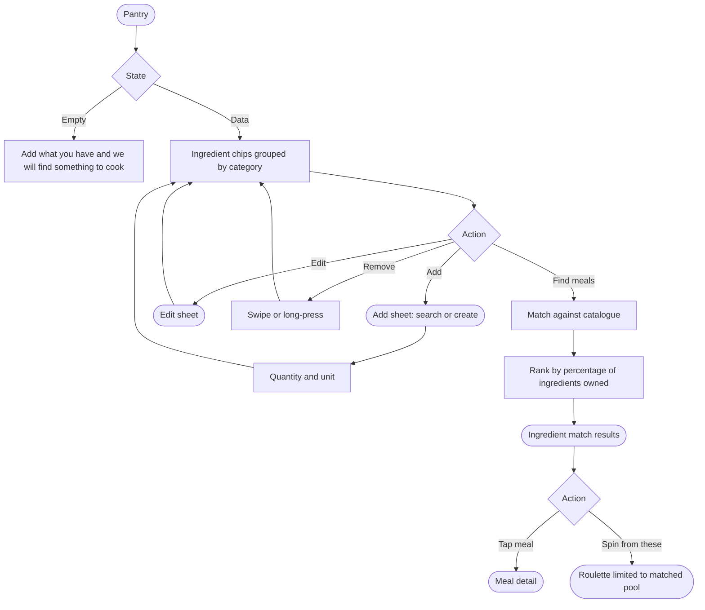
```mermaid
flowchart TD
    A([Pantry]) --> B{State}
    B -->|Empty| C[Add what you have and we will find something to cook]
    B -->|Data| D[Ingredient chips grouped by category]
    D --> E{Action}
    E -->|Add| F([Add sheet: search or create]) --> G[Quantity and unit] --> D
    E -->|Edit| H([Edit sheet]) --> D
    E -->|Remove| I[Swipe or long-press] --> D
    E -->|Find meals| J[Match against catalogue]
    J --> K[Rank by percentage of ingredients owned]
    K --> L([Ingredient match results])
    L --> M{Action}
    M -->|Tap meal| N([Meal detail])
    M -->|Spin from these| O([Roulette limited to matched pool])
```

**Rules**

* Adding an ingredient is search-first with create-if-missing. Users must never be blocked
  because our ingredient list is incomplete.
* **Staples — salt, pepper, oil, water, common seasonings — are assumed present** and never
  reduce a match percentage (US-E-02 acceptance criteria). Otherwise every meal caps around
  80% and the number stops meaning anything.
* "Spin from these" is the bridge back to the core loop. Pantry is not a destination; it is
  a filter on the decision.

---

## 13. Grocery

*Satisfies US-E-03, US-E-04, US-E-05*

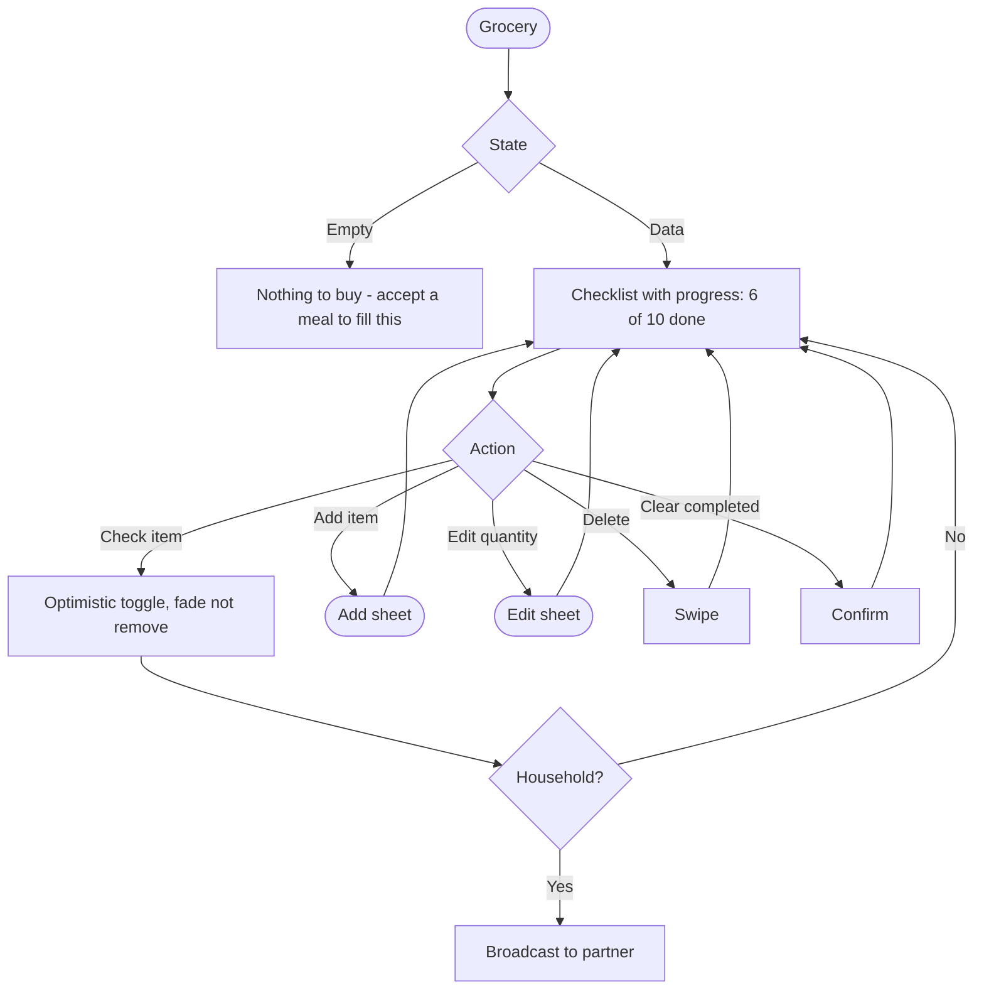
```mermaid
flowchart TD
    A([Grocery]) --> B{State}
    B -->|Empty| C[Nothing to buy - accept a meal to fill this]
    B -->|Data| D[Checklist with progress: 6 of 10 done]
    D --> E{Action}
    E -->|Check item| F[Optimistic toggle, fade not remove]
    E -->|Add item| G([Add sheet]) --> D
    E -->|Edit quantity| H([Edit sheet]) --> D
    E -->|Delete| I[Swipe] --> D
    E -->|Clear completed| J[Confirm] --> D
    F --> K{Household?}
    K -->|Yes| L[Broadcast to partner]
    K -->|No| D
```

Completed items fade in place rather than vanishing (`design_ui.md` §23) — items disappearing
under your thumb in a supermarket is disorienting. Duplicate additions merge quantities
rather than creating a second row.

---

## 14. Sharing one kitchen

*Rescoped at Sprint 37. Was "Couple mode — create, invite, join".*

This app has exactly two users and they live together (docs/app_feature.md,
"Scope"). What used to be a seven-sprint Couple Mode is now a single flow whose
only job is making both phones look at the same kitchen.

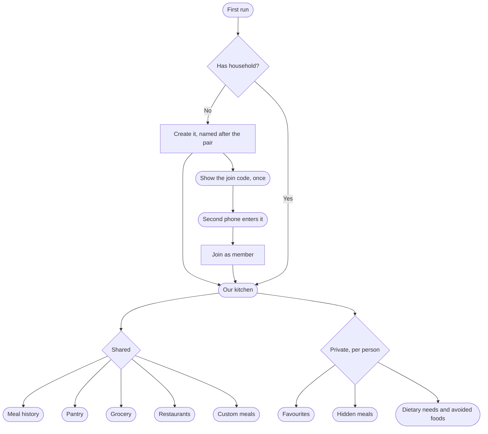
```mermaid
flowchart TD
    A([First run]) --> B{Has household?}
    B -->|No| C[Create it, named after the pair] --> D([Our kitchen])
    B -->|Yes| D

    C --> E([Show the join code, once])
    E --> F([Second phone enters it]) --> G[Join as member] --> D

    D --> H{Shared}
    H --> I([Meal history])
    H --> J([Pantry])
    H --> K([Grocery])
    H --> L([Restaurants])
    H --> M([Custom meals])

    D --> N{Private, per person}
    N --> O([Favourites])
    N --> P([Hidden meals])
    N --> Q([Dietary needs and avoided foods])
```

**Rules**

* One household. There is no second one to join, and no flow for leaving.
* The join code is entered once, on the second phone, and then never again.
* **Favourites and dislikes stay private.** A partner seeing what you dislike is a
  social cost with no product benefit; the engine reads both server-side
  regardless (docs/ARCHITECTURE.md §8.3).
* **Dietary needs stay personal and are applied to every spin.** A shared household
  does not merge them into an average — the strictest set wins, because producing a
  meal somebody cannot eat is worse than producing none.

**Not built**, deliberately: invitation management, expiring or reissued codes,
roles beyond owner and member, compatibility scores, per-partner preference
merging.

---

## 15. *Cut — Can't Agree voting*

Removed at Sprint 37. Was a voting round in which both partners rated a shared
candidate set and the app intersected the likes.

Two people standing in the same kitchen can say "not that one" out loud. A voting
round would add a turn-taking protocol, a waiting state and a no-match fallback to
a conversation that already works — and every second it costs comes straight out
of the sixty-second budget in §19.

The need it served is met by **Try again**, which excludes the rejected meal for
the rest of the session (§8).

*Section number retained so §16 onward and every code citation still resolve.*

---

## 16. *Cut — Meal planning*

Removed at Sprint 37. Was a weekly calendar, automatic plan generation, ingredient
reuse optimisation and a plan-to-grocery aggregation.

The premise of this app is deciding at seven in the evening. A planner answers the
opposite question — what will we eat on Thursday — and a household that plans a
week does not need a roulette. Building both would be building two products and
believing neither.

Ingredient reuse survives in a smaller and more useful form: the pantry weights
the roulette toward meals that use what is already in the kitchen (§12, Sprint 41).

`meal_plans` is dropped from the schema.

*Section number retained so §17 onward and every code citation still resolve.*

---

## 17. Profile and settings

*Satisfies US-G-01 … US-G-05*

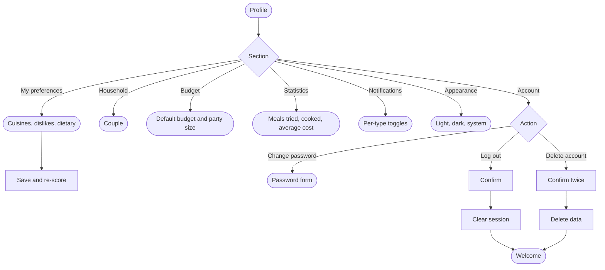
```mermaid
flowchart TD
    A([Profile]) --> B{Section}
    B -->|My preferences| C([Cuisines, dislikes, dietary]) --> D[Save and re-score]
    B -->|Household| E([Couple])
    B -->|Budget| F([Default budget and party size])
    B -->|Statistics| G([Meals tried, cooked, average cost])
    B -->|Notifications| H([Per-type toggles])
    B -->|Appearance| I([Light, dark, system])
    B -->|Account| J{Action}
    J -->|Change password| K([Password form])
    J -->|Log out| L[Confirm] --> M[Clear session] --> N([Welcome])
    J -->|Delete account| O[Confirm twice] --> P[Delete data] --> N
```

Preference changes take effect on the **next spin**, with no app restart. Account deletion
requires double confirmation and states plainly what is destroyed and what the household
retains.

---

## 18. Cross-cutting flows

### Session expiry

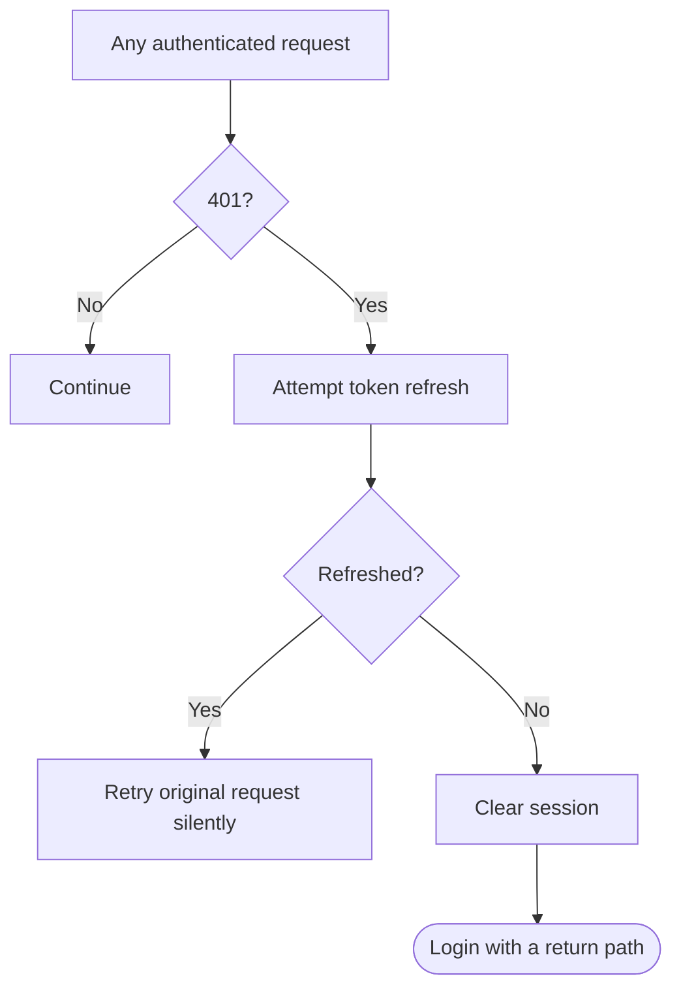
```mermaid
flowchart TD
    A[Any authenticated request] --> B{401?}
    B -->|No| C[Continue]
    B -->|Yes| D[Attempt token refresh]
    D --> E{Refreshed?}
    E -->|Yes| F[Retry original request silently]
    E -->|No| G[Clear session] --> H([Login with a return path])
```

The user is returned to where they were after re-authenticating. Never dump them on Home.

### Offline

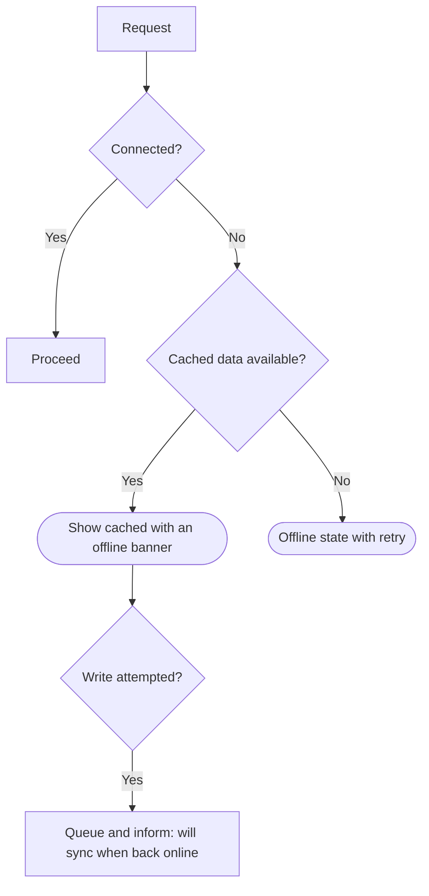
```mermaid
flowchart TD
    A[Request] --> B{Connected?}
    B -->|Yes| C[Proceed]
    B -->|No| D{Cached data available?}
    D -->|Yes| E([Show cached with an offline banner])
    D -->|No| F([Offline state with retry])
    E --> G{Write attempted?}
    G -->|Yes| H[Queue and inform: will sync when back online]
```

Reads degrade gracefully; writes are queued and clearly labelled. **The roulette works
offline against cached meals** — the core promise must survive a bad connection.

### Error handling

Every error surface follows the same shape: a friendly sentence, a plain-language cause when
one is knowable, and one obvious recovery action. No exception text, no error codes in the
primary message (`design_ui.md` §31).

---

## 19. Time-to-decision budget

The critical path, measured against the 60-second north star.

| Step | Target | Cumulative |
| ---- | -----: | ---------: |
| Cold launch to interactive Home | 1.5 s | 1.5 s |
| User orients, reads greeting and budget | 3 s | 4.5 s |
| Optional filter adjustment | 8 s | 12.5 s |
| Tap SPIN to candidate pool ready | 0.5 s | 13 s |
| Spin animation | 3 s | 16 s |
| User reads the result | 5 s | 21 s |
| **Accept** | 1 s | **22 s** |
| *Allowance for two re-spins* | +18 s | **40 s** |

Twenty-two seconds on the happy path, forty with two re-spins — both inside budget. The
margin exists because the pessimistic case, not the happy case, is what users remember.

**Where the budget dies:** an over-long animation, a filter screen that demands decisions
before the app will decide anything, and a slow first paint. Those three are the standing
performance risks for the life of the project.

---

## 20. Flow-to-story traceability

| Flow | Stories |
| ---- | ------- |
| First launch | US-A-01, US-A-05 |
| Registration | US-A-02 |
| Login | US-A-02, US-A-05 |
| Onboarding | US-A-03, US-A-04, US-A-06 |
| Home | US-B-01, US-B-03 |
| Roulette | US-B-01 … US-B-09 |
| Meal acceptance | US-B-05, US-C-08, US-E-03, US-E-04 |
| Meal discovery | US-C-01, US-C-02 |
| Meal detail and custom meals | US-C-03 … US-C-07 |
| Meal history | US-C-08, US-B-06 |
| Pantry | US-E-01, US-E-02 |
| Grocery | US-E-03, US-E-04, US-E-05 |
| Sharing one kitchen | US-D-01 … US-D-05, **narrowed** — see §14 |
| ~~Can't Agree~~ | US-D-06, **cut** at Sprint 37 |
| ~~Planner~~ | US-F-01 … US-F-04, **cut** at Sprint 37 |
| Restaurant roulette | *new at Sprint 45 — stories to be written* |
| Profile | US-G-01 … US-G-05 |

Every P0 story appears in at least one flow, **except the ones cut at Sprint 37**
(US-D-06, US-F-01 … US-F-04). Those are struck through above rather than deleted,
because a story that silently disappears from a traceability table reads as an
oversight, and these were a decision — see docs/project_dev.md, "Cut".
